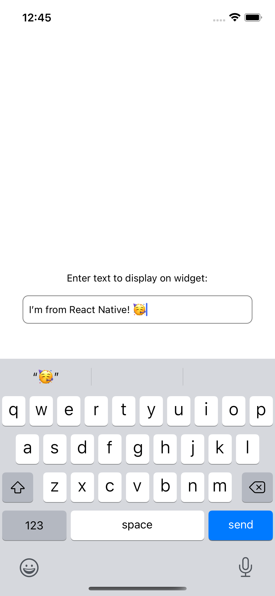
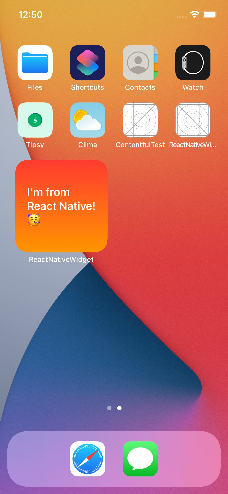

## iOS Widgetkit + React Native [Blog Post Here](https://teamairship.com/home-screen-widgets-ios-widgetkit-react-native/)

 
 

#### This repo contains a working example using Widgetkit + React Native. You are able to send data to an App Group from which you can pull data into the widget in Swift.